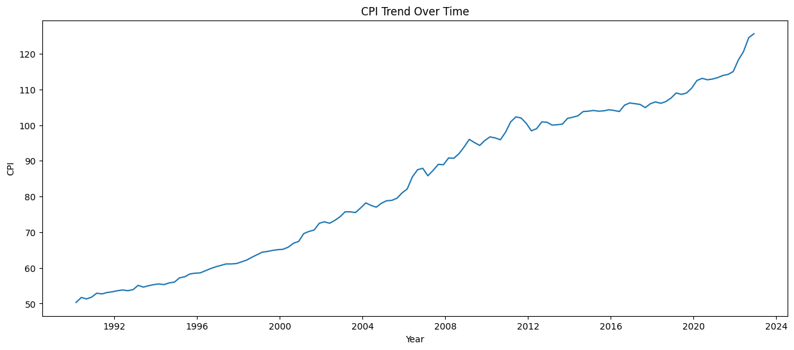
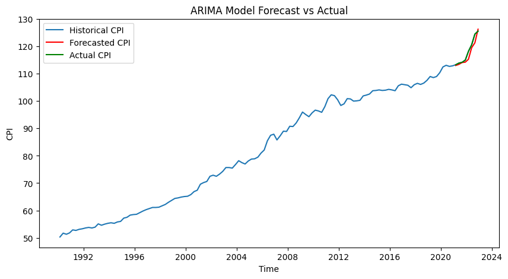

# CPI Forecasting

Time Series Forecasting | Economic Analytics | Machine Learning

## Project Overview

The Consumer Price Index (CPI) measures the average change in prices of goods and services such as food, healthcare, and housing. Accurate CPI forecasting is essential for governments, financial institutions, and businesses to make informed economic and monetary policy decisions.

This project develops predictive models to forecast CPI using over 30 years of historical quarterly data (1990–2022). Multiple statistical and machine learning approaches were implemented to evaluate their forecasting performance and identify the most reliable model.

The objective of this project is to demonstrate how time series analysis and machine learning techniques can be applied to economic indicators to support data-driven decision making.

---

## Dataset

The dataset contains quarterly CPI observations from March 1990 to December 2022, providing 132 historical data points for modelling and forecasting.

**Key variables:**
- **Date** – Quarterly observation period
- **CPI** – Consumer Price Index value

The dataset captures long-term inflation trends across multiple economic cycles.

---

## Exploratory Data Analysis

The CPI time series demonstrates a strong long-term upward trend, reflecting persistent inflation over the past three decades.

From 1990 to 2022, the CPI index increased steadily, rising from approximately 50 to over 120. The trend is relatively smooth, indicating gradual inflation growth without extreme volatility.

---

## Modelling Approach

Multiple forecasting models were implemented to compare their performance:

| Model | Purpose |
|------|------|
| Holt-Winters Additive | Captures trend and constant seasonal patterns |
| Holt-Winters Multiplicative | Handles seasonality that grows with trend |
| ARIMA | Models non-seasonal time series patterns |
| SARIMA | Extends ARIMA to capture seasonal behaviour |
| LSTM | Deep learning model for non-linear time series patterns |

This combination of models allows comparison between traditional statistical forecasting methods and modern machine learning techniques.

---

## Model Evaluation

Models were evaluated using **Mean Squared Error (MSE)** to measure forecasting accuracy.

| Model | MSE |
|------|------|
| ARIMA | **2.6125** |
| SARIMA | 2.8089 |
| Holt-Winters Additive | 2.9250 |
| Holt-Winters Multiplicative | 3.0318 |
| LSTM | 4.1500 |

The **ARIMA model achieved the lowest MSE**, indicating the most accurate forecasts among the tested models.

---
## ARIMA Forecast

The ARIMA model was implemented to capture the underlying time series structure and generate forecasts.

The forecasted CPI values closely follow the actual CPI observations in the validation period, demonstrating the model’s ability to capture the underlying inflation trend.

## Key Insights

Several important insights emerged from the analysis:

- CPI exhibits a **strong long-term upward trend**, reflecting persistent inflation.
- Seasonal effects exist but are **less significant than the overall trend**.
- Traditional statistical models such as **ARIMA and SARIMA outperform deep learning models** when working with relatively small economic datasets.
- The CPI forecast suggests **price stability around 125 between 2023–2024**, aligning with central bank inflation-control policies.

---

## Economic Interpretation

The forecasted CPI trend aligns with monetary policy adjustments, particularly the gradual increase of the central bank cash rate between 2023 and 2024.

Rising interest rates typically help control inflation by reducing excessive economic demand. The stable CPI projection indicates that policy measures may successfully maintain inflation within a manageable range.

However, several external risks may influence CPI forecasts:

- Global supply chain disruptions
- Energy price volatility
- Wage growth and labour market changes
- Future monetary policy adjustments

These factors highlight the importance of continuously updating forecasting models using new data.

---

## Tools & Technologies

Python  
Pandas  
NumPy  
Statsmodels  
TensorFlow / Keras  
Matplotlib  
Time Series Analysis

---
